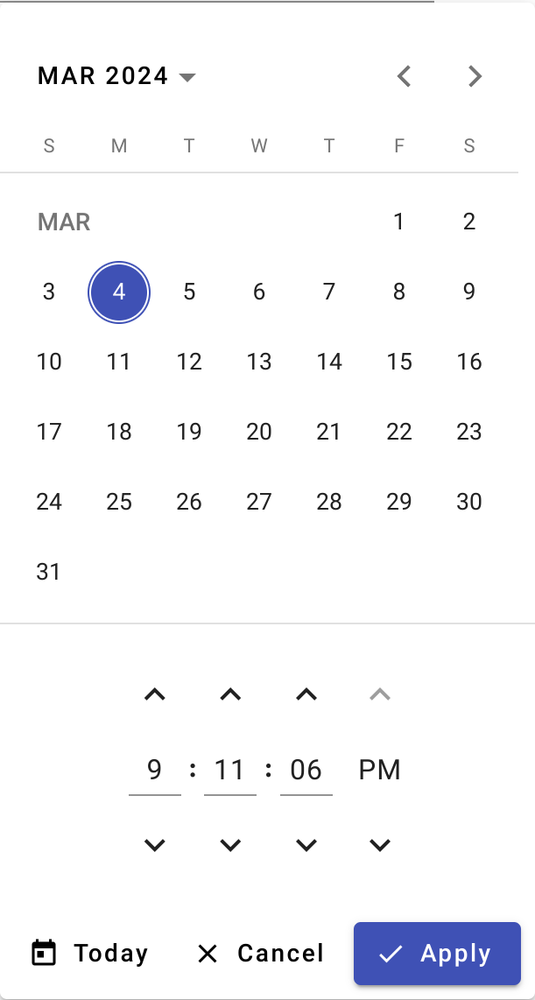
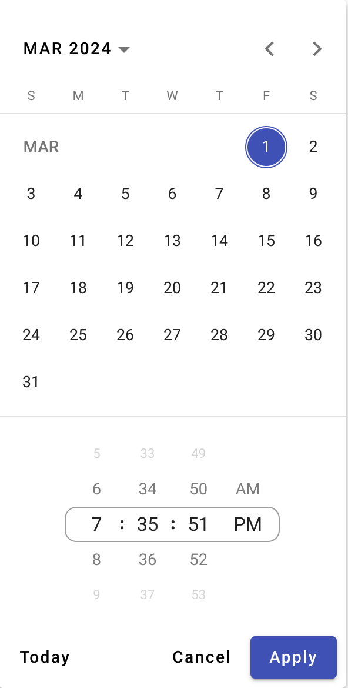

## UTE Material - Datepicker Time

Datepicker Time is highly-customizable, Angular SSR, multi-locale module with a variety of designs and interactions for both mobile and desktop platforms time picker for Angular Material Datepicker.

|  |  |
| -------------------------------------------- | ------------------------------------------- |

## About US

We are a small group of enthusiasts, so if you want to improve the development of these modules, any help would be greatly appreciated.

-   Contact us if you have any question or suggestion.
-   Feel free to open the [issues](https://github.com/under-tree-e/ute-material.ngx/issues) or provide a PR.
-   If you like this project, support by starring⭐.

<a href="https://www.buymeacoffee.com/under.tree.e" target="_blank"></a>

Live demo with all settings, [HERE](https://ute-material.github.io/components/datepicker-time)

## Getting started

Install the main package:

```shell
npm i ngx-ute-material
```

Import `UteDatepickerTime` into your `app.module.ts`:

```ts
import { NgModule } from "@angular/core";
import { BrowserModule } from "@angular/platform-browser";

import { AppRoutingModule } from "./app-routing.module";
import { AppComponent } from "./app.component";
import { UteDatepickerTime } from "ngx-ute-material/datepicker-time";

@NgModule({
    declarations: [AppComponent],
    imports: [BrowserModule, AppRoutingModule, UteDatepickerTime],
    providers: [],
    bootstrap: [AppComponent],
})
export class AppModule {}
```

Add component to your html code near `mat-datepicker`:

```html
<mat-form-field>
    <mat-label>Choose a datetime</mat-label>
    <input matInput [matDatepicker]="picker" />
    <mat-hint>MM/DD/YYYY, HH:mm:ss</mat-hint>
    <mat-datepicker-toggle matIconSuffix [for]="picker"></mat-datepicker-toggle>
    <mat-datepicker #picker></mat-datepicker>
    <ute-datepicker-time [matDatepicker]="picker"></ute-datepicker-time>
</mat-form-field>
```

## Input Properties

| Property          |                                Input type                                 | Default value | Description                                                                                                                                                                                      |
| ----------------- | :-----------------------------------------------------------------------: | :-----------: | ------------------------------------------------------------------------------------------------------------------------------------------------------------------------------------------------ |
| desktopStyle      |                      string:<br>'button' \| 'wheel'                       |   'button'    | TimePicker visual styles. `Wheel` - mobile like style with touch interactions. `Button` - input field with next/pre buttons.                                                                     |
| mobileStyle       |                      string:<br>'button' \| 'wheel'                       |    'wheel'    | TimePicker visual styles. `Wheel` - mobile like style with touch interactions. `Button` - input field with next/pre buttons.                                                                     |
| infiniteScroll    |                                  boolean                                  |     true      | An infinite scroll (`true`) means that items can be scrolled in an infinite loop. Otherwise (`false`), it's a picker bounded by its first and last items.                                        |
| visibleItemsCount |                          number:<br>1 \| 3 \| 5                           |       5       | How many items are displayed on the wheel/picker. Must be `odd` so that the selection is in the middle of the wheel. The range restriction is for aesthetics purposes.                           |
| hourFormat        |                            number:<br>12 \| 24                            |      24       | Choose between a `24-hour` and `12-hour` format. A 12-hour format automatically adds another picker for AM/PM.                                                                                   |
| hourStep          |                        number:<br>1 \| 2 \| 3 \| 4                        |       1       | Shows the hour values that are a multiple of the chosen number.                                                                                                                                  |
| minuteStep        |                 number:<br>1 \| 5 \| 10 \| 15 \| 20 \| 30                 |       1       | Shows the minute values that are a multiple of the chosen number. E.g. if you want to restrict the minutes options for quarters of an hour, set the value to 15.                                 |
| secondStep        |                 number:<br>1 \| 5 \| 10 \| 15 \| 20 \| 30                 |       1       | Shows the second values that are a multiple of the chosen number. E.g. if you want to restrict the seconds options for quarters of a minute, set the value to 15.                                |
| decoratorStyle    |               string:<br>'outline' \| 'underline' \| 'none'               |   'outline'   | Adds decoration to the selected values on the pickers. `Outline` - creates a stroke around the selected values, including `AM/PM`. `Underline` - underlines numerical values, excluding `AM/PM`. |
| showSeconds       |                                  boolean                                  |     true      | Adds a picker for seconds.                                                                                                                                                                       |
| showToday         |                                  boolean                                  |     true      | Shows `Today` button in the bottom action bar.                                                                                                                                                   |
| showIcon          |                                  boolean                                  |     false     | Displays icons on the buttons in the action bar. Required: `[Material Icon Link](https://developers.google.com/fonts/docs/material_icons#setup_method_1_using_via_google_fonts)`Linkbelow.       |
| showDiviner       |                                  boolean                                  |     true      | Show two dots (`:`) between pickers.                                                                                                                                                             |
| customButtons     | object:<br>{ today: "string"; cancel: "string"; apply: "string" } \| null |     null      | Allows you to insert your own text in the reference button on the action bar below, or hide the text by writing the value `''`                                                                   |
| dynamicTouchUI    |                                  boolean                                  |     false     | Dynamically adds the `touchUi` to `mat-datepicker` parameter depending on the current device. Set (`false`) if you are modifying `touchUi`.                                                      |

## Additional Info

-   If you use `mat-datepicker-actions`, the module will automatically use your variant instead of the default one.
-   The module supports changing the locale (used in `mat-datepicker-actions`) for the following languages:
    `en | ar | zh | cs | da | fr | de | it | ja | ko | pl | pt | ro | es | sv | uk`
-   Available uses of `min` and `max` options from `mat-datepicker`. Will be displayed in `red` on the time pickers.
-   If you want to use `showIcon` param - don't forget add `[Material Icon Link](https://developers.google.com/fonts/docs/material_icons#setup_method_1_using_via_google_fonts)` to `index.html`.

## Planned Improvements

| Improvement                     | Priority |      Status      |
| ------------------------------- | :------: | :--------------: |
| Timepicker for Range Datepicker |   High   | Work in Progress |
| Timepicker single module        |   Low    |       Wait       |

## Sources and inspiration

Below is a list of those projects on the basis of which this project was created:

-   [Angular Components](https://github.com/angular/components)
-   [Angular-material-components](https://github.com/h2qutc/angular-material-components/tree/master)
-   [Timeless picker](https://github.com/eliasab16/timeless-picker)
-   [AG-Swipe](https://github.com/aGoncharuks/ag-swipe/tree/master)
